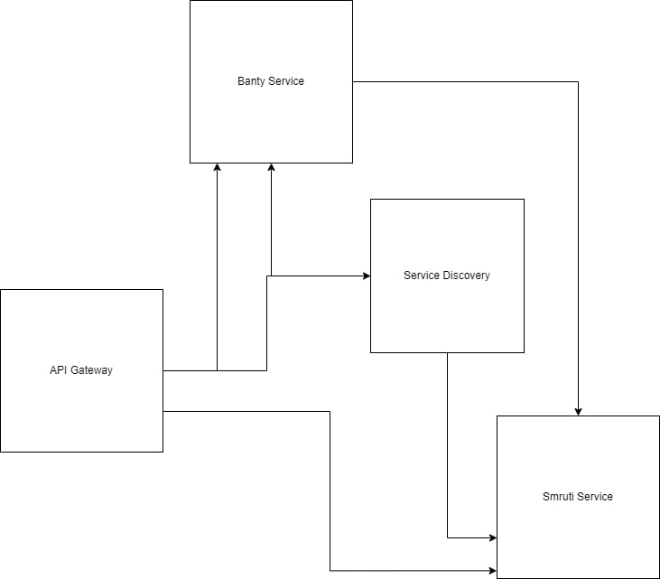

# Simple Microservice
### Hello to microservice
#### Diagram

## Run in docker
1. git checkout docker-feature.
2. docker-compose up
### All url
1. http://localhost:9000/eureka 
2. http://localhost:9000/smruti/hello 
3. http://localhost:9000/banty/hyy
4. http://localhost:9000/banty/hello
